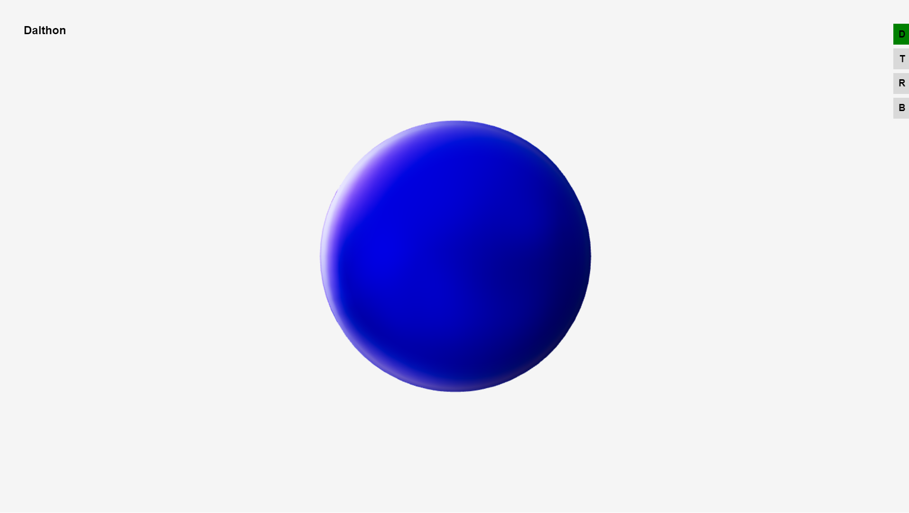
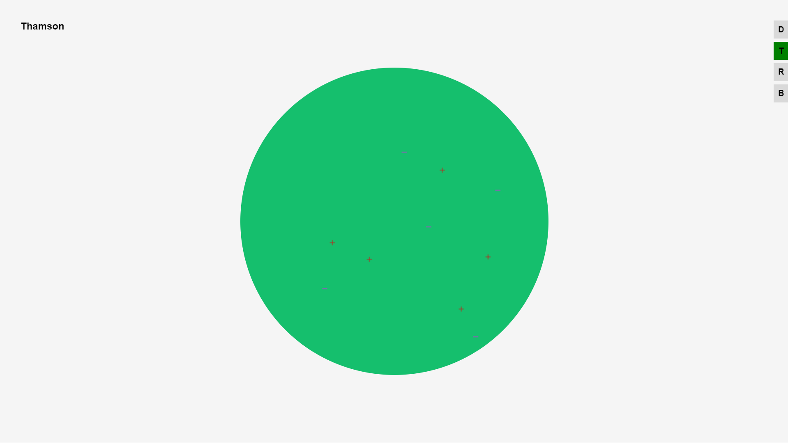
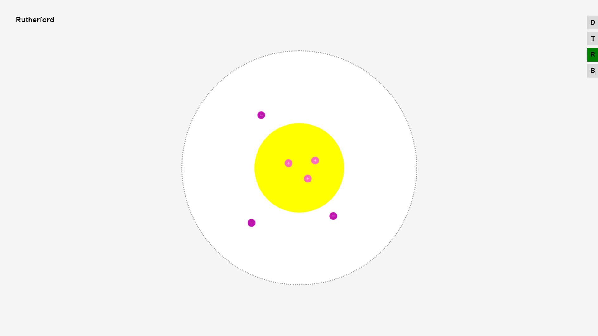
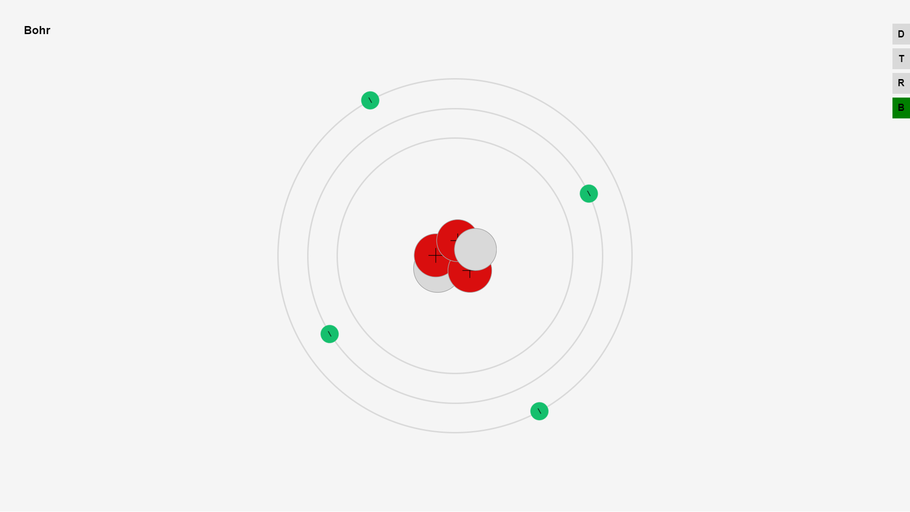

**Story**
When I was in tenth grade, my teacher asked me to write an educational material for our chemistry teacher's university thesis and gave it to me as a project assignment. The aim was to make it easier for people learning the atomic model and to ensure long-term learning thanks to its interactive interface.

Our chemistry teacher gave us a paper about atomic models and how they should look like.

I've only **used** <a href="https://threejs.org/" style="background: linear-gradient(to right, #ff7e5f, #feb47b); -webkit-background-clip: text; -webkit-text-fill-color: transparent; text-decoration: none; font-weight: bold;">Three Js</a> and **canvas**

---


---

**Information about atomic models**

- <a href="https://tr.wikipedia.org/wiki/John_Dalton" style="background: linear-gradient(to right, #ff7e5f, #feb47b); -webkit-background-clip: text; -webkit-text-fill-color: transparent; text-decoration: none; font-weight: bold;">Jhon Dalton</a>
	-  He described atoms as inseparable and solid particles, arguing that each element has its own unique atoms. (1803)
- <a href="https://tr.wikipedia.org/wiki/J._J._Thomson" style="background: linear-gradient(to right, #ff7e5f, #feb47b); -webkit-background-clip: text; -webkit-text-fill-color: transparent; text-decoration: none; font-weight: bold;">Joseph John Thomson</a>
	- He discovered the existence of electrons and proposed that the atom is composed of negatively charged electrons moving freely in a positively charged sphere. (1897)
- <a href="https://en.wikipedia.org/wiki/Ernest_Rutherford" style="background: linear-gradient(to right, #ff7e5f, #feb47b); -webkit-background-clip: text; -webkit-text-fill-color: transparent; text-decoration: none; font-weight: bold;">Ernest Rutherford</a>
	- With the gold foil experiment, he proposed that most of the atom is empty space, with electrons orbiting around a dense nucleus (1911)
- <a href="https://tr.wikipedia.org/wiki/Niels_Bohr" style="background: linear-gradient(to right, #ff7e5f, #feb47b); -webkit-background-clip: text; -webkit-text-fill-color: transparent; text-decoration: none; font-weight: bold;">Niels Bohr</a>
	- He proposed that there are positively charged protons and neutrons in the nucleus of the atom and that there are electrons orbiting around it in specific orbits, that the energy levels of the electrons in these orbits are specific, and that they emit light as they pass from certain energy levels to others. (1913)

---

|         |  |
| -------------------------------------- | -------------------------------- |
|  |        |

---

**Installation**
You need to have <a href="https://nodejs.org/en" style="background: linear-gradient(to right, #ff7e5f, #feb47b); -webkit-background-clip: text; -webkit-text-fill-color: transparent; text-decoration: none; font-weight: bold;">Node Js</a>  installed on your computer for installation

```bash
npm vite@latest
```

-  Enter the name of the project
	-  Choose Vanilla Js
		-  Select Javascript

```bash
cd projet name
```

```bash
npm install
```

-  Open with Code Editor
	-  Copy the files you downloaded
	-  Open the console

```bash
npm run dev
```
